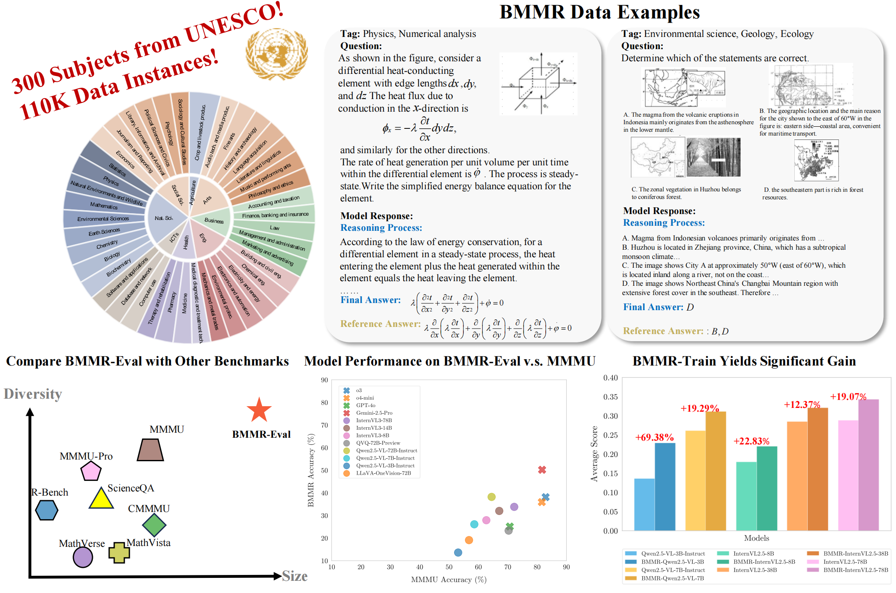

# BMMR Dataset

[**🌐 Homepage**](https://bmmr.pages.dev/) | [**🏆 Leaderboard**](https://huggingface.co/spaces/guanyu615/BMMR_leaderboard) | [**🤗 BMMR**](https://huggingface.co/datasets/guanyu615/BMMR) | [**📖 Paper**](http://arxiv.org/abs/2507.03483)

This repo contains the evaluation code for the paper "[BMMR: A Large-Scale Bilingual Multimodal Multi-Discipline Reasoning Dataset](http://arxiv.org/abs/2507.03483)"


## 🔔News

- **🔥[2025-07-08]: We have released the evaluation scripts on GitHub, and we warmly welcome everyone to try them out! 👏**
- **🔥[2025-07-08]: We have released the dataset on [HuggingFace](https://huggingface.co/datasets/guanyu615/BMMR)</b></a>! 🌟**

## Introduction

We introduce BMMR, a large-scale bilingual, multimodal, multi-disciplinary reasoning dataset for the community to develop and evaluate large multimodal models (LMMs). BMMR comprises **110k** college-level questions spanning **300** UNESCO-defined subjects, spanning diverse formats—multiple-choice, fill-in-the-blank, and open-ended QA—and sourced from both print and digital media such as books, exams, and quizzes. All data are curated and filtered via a human-in-the-loop and scalable framework, and each instance is paired with a high-quality reasoning path. The dataset is organized into two parts: **BMMR-Eval** that comprises 20,458 high-quality instances to comprehensively assess LMMs’ knowledge and reasoning across multiple disciplines in both Chinese and English; and **BMMR-Train** that contains 88,991 instances to support further research and development, extending the current focus on mathematical reasoning to diverse disciplines and domains. In addition, we propose the process-based multi-discipline verifier (i.e., **BMMR-Verifier**) for accurate and fine-grained evaluation of reasoning paths. 
Extensive experiments on $24$ models reveal that (i) even SOTA models (e.g., o3 and Gemini-2.5-Pro) leave substantial headroom on BMMR-Eval; (ii) reasoning models exhibit discipline bias and outperform LMMs only on specific subjects; (iii) open-source models still trail their proprietary counterparts; and (iv) fine-tuning on BMMR-Train narrows this gap. Additionally, we conduct reasoning-chain analyses using BMMR-Verifier and other in-depth studies, uncovering the challenges LMMs currently face in multidisciplinary reasoning. We will release the data, and we hope our work can offers insights and contributions to the community.



## Dataset

The evaluation set and training set of BMMR can be found in:

- [**🤗 BMMR**](https://huggingface.co/datasets/guanyu615/BMMR)

## Evaluation

We have merged our benchmark into the [VLMEvalKit](https://github.com/open-compass/VLMEvalKit/tree/main). You can use VLMEvalKit for evaluation, or alternatively, use our evaluation script as described below:


### Prepare

Download the test set and put it into `./data/`.

### Installation

```
pip install -r requirements.txt
```

### Run

You need to deploy the model using either [vLLM](https://github.com/vllm-project/vllm) or [LMDeploy](https://github.com/InternLM/lmdeploy). Then, update the src/config.json file with the parameters such as base_url, api_key, and model based on your deployment. Finally, run the script eval.sh.

```
bash src/eval.sh
```


## Contact

- Zhiheng Xi: zhxi22@m.fudan.edu.cn

## Citation

**BibTeX:**

```
@misc{xi2025bmmrlargescalebilingualmultimodal,
      title={BMMR: A Large-Scale Bilingual Multimodal Multi-Discipline Reasoning Dataset}, 
      author={Zhiheng Xi and Guanyu Li and Yutao Fan and Honglin Guo and Yufang Liu and Xiaoran Fan and Jiaqi Liu and Jingchao Ding and Wangmeng Zuo and Zhenfei Yin and Lei Bai and Tao Ji and Tao Gui and Qi Zhang and Xuanjing Huang},
      year={2025},
      eprint={2507.03483},
      archivePrefix={arXiv},
      primaryClass={cs.CL},
      url={https://arxiv.org/abs/2507.03483}, 
}
```

## Acknowledgement

This repository is built with reference to [MMMU](https://github.com/MMMU-Benchmark/MMMU/tree/main).
